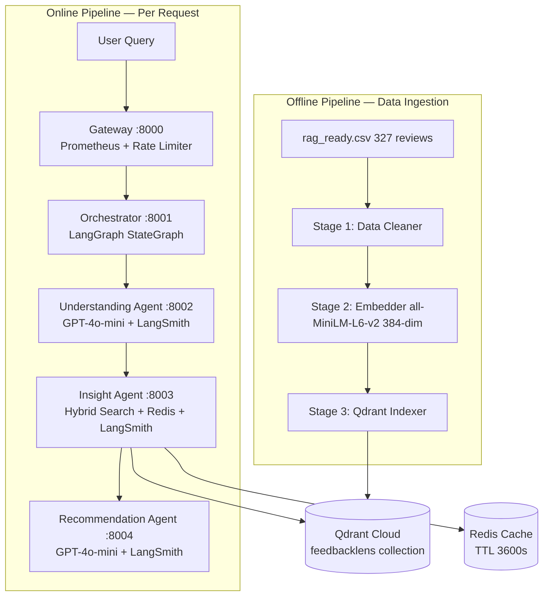
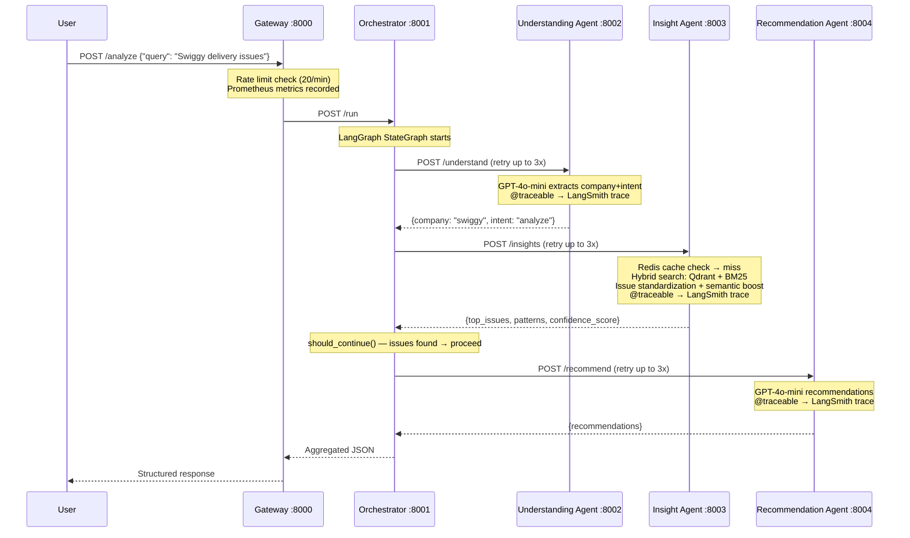
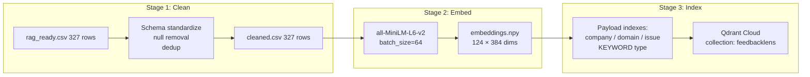
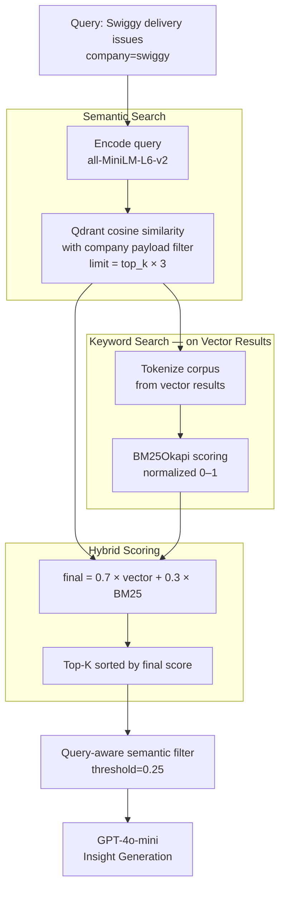
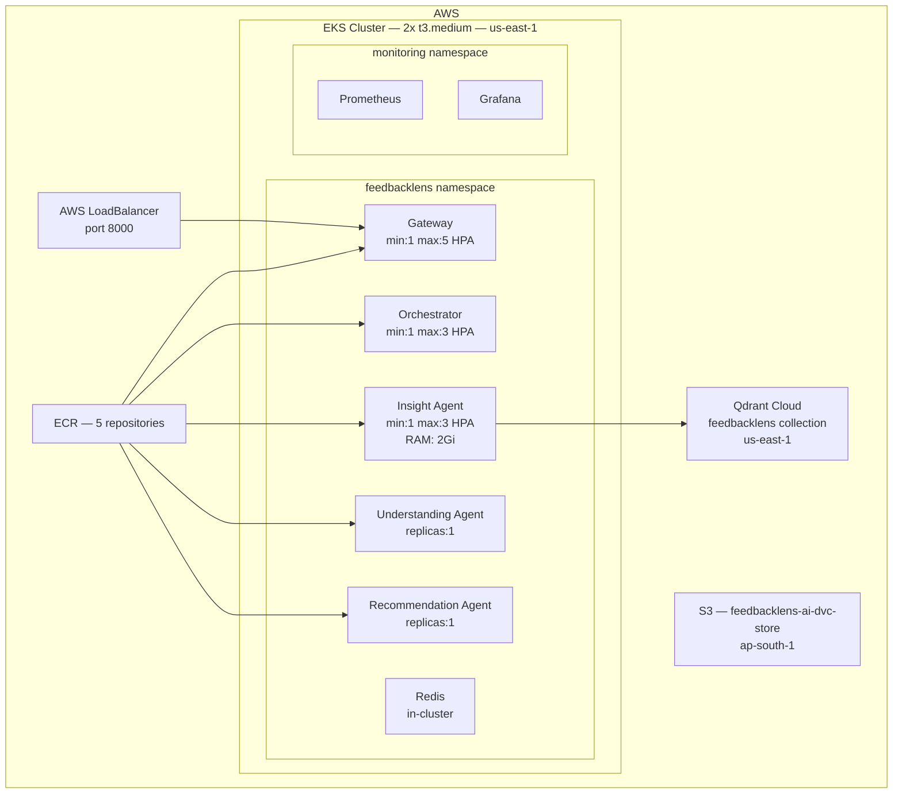

# 🔍 FeedbackLens AI — Version 2

### Production-Grade Multi-Agent Feedback Intelligence Platform


---

## 📖 Overview

**FeedbackLens AI v2** is a **production-grade, multi-agent RAG system** that converts raw customer feedback into structured business insights and actionable recommendations.

Companies upload customer reviews → FeedbackLens processes them through a **3-agent pipeline** — extracting company intent, retrieving relevant context via hybrid search, and generating specific recommendations — all deployed on **AWS EKS** with automated CI/CD, full **LangSmith tracing**, **rate limiting**, and a **custom evaluation framework**.

> **What's new in V2?** LangSmith `@traceable` on all agents, `slowapi` rate limiting (20 req/min), `tenacity` retry logic with exponential backoff, custom deterministic eval system replacing RAGAS, enhanced Locust load testing with SLA validation, and deeper issue standardization in the Insight Agent.

---

## ❌ Problem

- Companies receive thousands of unstructured customer reviews but lack tools to extract structured insights at scale
- Manual analysis takes **days per dataset** and misses cross-review patterns
- Generic feedback tools don't provide **actionable, company-specific recommendations**
- No scalable pipeline from raw CSV → production insights

---

## ✅ Solution

| Problem | Solution |
|---|---|
| Unstructured feedback | 3-agent RAG pipeline extracts structured insights |
| Missing patterns | Hybrid BM25 + vector search across 124 indexed reviews |
| Generic recommendations | GPT-4o-mini with company-specific context |
| No scalability | AWS EKS with HPA autoscaling |
| Manual deployment | Dual CI/CD pipelines — ingest + deploy |
| No observability | LangSmith tracing on every agent call |
| No abuse protection | slowapi rate limiting — 20 req/min per IP |
| Transient failures | tenacity retry — 3 attempts, exponential backoff |

---

## 🆕 V2 vs V1 — What Changed

| Feature | V1 | V2 |
|---|---|---|
| **LLM Tracing** | ❌ No tracing | ✅ LangSmith `@traceable` on all 3 agents |
| **Rate Limiting** | ❌ None | ✅ `slowapi` — 20/min `/analyze`, 10/min `/batch` |
| **Retry Logic** | ❌ Single attempt | ✅ `tenacity` — 3 retries, exponential backoff (1s→2s→4s) |
| **Evaluation** | RAGAS (wrong eval type) | ✅ Custom deterministic eval — cosine similarity + rule-based |
| **Load Testing** | Basic Locust | ✅ SLA validation, catch_response, multi-company, task weights |
| **Prometheus** | Counter + Histogram | ✅ + Gauge (active requests) + rate limit Counter |
| **Issue Processing** | Basic extraction | ✅ Standardization → fallback map → semantic boost → dedup |
| **Query Normalization** | Basic lowercase | ✅ Typo correction map in Insight Agent |
| **Unit Tests** | ❌ None | ✅ 7 unit tests — normalize, cache, hybrid score |

---

## 🏗️ High-Level Architecture



---

## 🔁 End-to-End Request Flow



---

## 🧠 RAG Pipeline — DVC 3-Stage



---

## 🔍 Hybrid Search Pipeline



---

## 📊 Production Results

### Live Test on AWS EKS — Swiggy Analysis

```
Input:
  query: "Analyze Swiggy delivery issues"

Output:
  company:          swiggy
  top_issues:       ["delivery delays", "high delivery charges",
                     "inconsistent delivery times"]
  patterns:         ["customers frustrated with delivery delays",
                     "positive feedback on offers overshadowed by complaints"]
  recommendations:  ["Introduce guaranteed delivery time with discount for late deliveries",
                     "Utilize predictive analytics to reduce peak hour delays by 20%",
                     "Implement real-time ETA updates every 3 minutes"]
  confidence_score: 0.90
  failure_rate:     0%
```

### Load Test — Locust on AWS EKS

```
Endpoint:         POST /analyze (EKS LoadBalancer)
Users:            5 concurrent
Total requests:   109
Failures:         0 (0.00%)
Throughput:       0.96 req/s
Health P95:       310ms
Analyze avg:      3.86s
SLA threshold:    30s (never breached)
Task distribution: Swiggy 3x | Uber 2x | Zomato 1x | Health 1x
```

### Custom Evaluation — eval_system.py

```
Method:           Custom deterministic eval (cosine similarity + rule-based)
Test cases:       8 (normal, typo, ambiguous, sparse-data, indirect)
Pass threshold:   0.70 composite score
Pass rate:        5/8 (62.5%)
Avg score:        0.75
Best case:        0.95 — "swiggi delivry prblms" (typo query)
Worst case:       0.54 — "uber pricing issues" (21 reviews only)
Avg latency:      ~5.2s per case
Eval method:      relevance (0.7 weight) + rec quality (0.3 weight)
LLM-as-judge:     NOT used — deterministic preferred for reproducibility
```

> **Note on RAGAS:** V1 used RAGAS (Faithfulness 0.81, Answer Relevancy 0.96). V2 replaced it with a custom eval because RAGAS is designed for QA chatbots, not multi-agent feedback analysis systems. Our custom eval measures what actually matters — issue relevance and recommendation actionability.

---

## ⚡ Infrastructure



---

## 🔄 CI/CD Pipelines

### Ingest Pipeline — triggers on data changes
```
Trigger:  push to ingestion-pipeline/** or data/rag_ready.csv.dvc or params.yaml or reingest.flag
Steps:    checkout → install deps → configure AWS → DVC pull
          → dvc repro --force → dvc push to S3
Duration: ~7–8 minutes
```

### Deploy Pipeline — triggers on code changes
```
Trigger:  push to services/** or shared/**
Steps:    detect changed services (dorny/paths-filter)
          → matrix build (parallel per changed service)
          → docker build with root context
          → push to ECR with SHA + latest tags
Duration: ~8–25 min (limited by insight-agent — 2.93GB image)
```

---

## 🔐 Rate Limiting (V2 New)

```python
# Gateway — services/gateway/app/main.py
limiter = Limiter(key_func=get_remote_address)  # per-IP

@app.post("/analyze")
@limiter.limit("20/minute")   # interactive queries
async def analyze(...): ...

@app.post("/batch")
@limiter.limit("10/minute")   # batch jobs — stricter
async def batch(...): ...

# 429 response:
{
  "error": "Rate limit exceeded",
  "detail": "Too many requests. Max 20 requests per minute per IP.",
  "retry_after": "60 seconds"
}
```

---

## 🔁 Retry Logic (V2 New)

```python
# Orchestrator — tenacity retry on all 3 agent HTTP calls
@retry(
    retry=retry_if_exception_type((httpx.TimeoutException, httpx.ConnectError)),
    stop=stop_after_attempt(3),
    wait=wait_exponential(multiplier=1, min=1, max=8),  # 1s → 2s → 4s
    reraise=True
)
async def _call_understanding_agent(query, company): ...
async def _call_recommendation_agent(company, issues, patterns): ...

# Insight agent gets slightly more backoff (heavier service)
@retry(..., wait=wait_exponential(multiplier=1, min=1, max=10))
async def _call_insight_agent(query, company, focus, top_k): ...
```

---

## 📡 LangSmith Tracing (V2 New)

```python
# All 3 agent functions are traced — zero-code enable
# Set LANGCHAIN_API_KEY env var → traces appear in LangSmith dashboard

@traceable(name="understanding-node")   # orchestrator/graph.py
async def understanding_node(state): ...

@traceable(name="insight-node")
async def insight_node(state): ...

@traceable(name="recommendation-node")
async def recommendation_node(state): ...

@traceable(name="understanding-agent")  # understanding_agent/agent.py
async def understand_query(query, company): ...

@traceable(name="insight-agent")        # insight_agent/agent.py
async def generate_insights(...): ...
```

> Without `LANGCHAIN_API_KEY`, decorators are no-ops — system runs normally. Zero performance overhead when tracing is disabled.

---

## 🧰 Tech Stack

| Category | Technology |
|---|---|
| Agent Orchestration | LangGraph StateGraph — conditional routing, shared state |
| LLM Integration | LangChain ChatOpenAI — GPT-4o-mini |
| LLM Tracing | LangSmith `@traceable` — all agents |
| Embeddings | sentence-transformers/all-MiniLM-L6-v2 — 384-dim |
| Vector DB | Qdrant Cloud — HNSW, payload indexes, async client |
| Keyword Search | BM25 Okapi (rank-bm25) |
| LLM | GPT-4o-mini (temp: 0.1 understanding / 0.1 insight / 0.3 recommendation) |
| Caching | Redis TTL 3600s — MD5 cache key, smart empty-result skip |
| Rate Limiting | slowapi — 20/min `/analyze`, 10/min `/batch` |
| Retry | tenacity — 3 attempts, exponential backoff |
| Evaluation | Custom eval — cosine similarity + rule-based rec scoring |
| Data Pipeline | DVC 3-stage — clean → embed → index — S3 remote |
| Load Testing | Locust — SLA validation, catch_response, task weights |
| Serving | FastAPI async microservices |
| Containerization | Docker — root build context for shared/ access |
| Infrastructure | AWS EKS (Kubernetes 1.32) + ECR + S3 + LoadBalancer |
| Autoscaling | HPA — gateway 1–5, orchestrator 1–3, insight-agent 1–3 |
| Monitoring | Prometheus (Counter + Histogram + Gauge) + Grafana |
| CI/CD | GitHub Actions — dual pipeline (ingest + deploy) |
| Unit Tests | pytest — 7 tests (normalize, cache key, hybrid score) |

---

## 🚀 Local Setup

```bash
git clone https://github.com/akashagalave/feedbacklens-v2

# Setup environment
python -m venv venv
source venv/bin/activate   # Windows: venv\Scripts\activate
pip install -r requirements.txt

# Configure environment
cp .env.example .env
# Required: OPENAI_API_KEY, QDRANT_HOST, QDRANT_API_KEY
# Optional: LANGCHAIN_API_KEY  (enables LangSmith tracing)

# Pull data from DVC (S3 remote)
dvc pull

# Start all services
docker-compose up --build

# Run ingestion pipeline (clean → embed → index)
dvc repro

# Health check
curl http://localhost:8000/health

# Test query
curl -X POST http://localhost:8000/analyze \
  -H "Content-Type: application/json" \
  -d '{"query": "Analyze Swiggy delivery issues", "company": "swiggy"}'

# Run custom evaluation
python eval_system.py

# Run load test (local)
locust -f locustfile.py --headless -u 5 -r 1 --run-time 2m \
  --html reports/locust_report.html

# Run unit tests
pytest tests/test_feedbacklens.py -v
```

---

## 🔑 System Modes

### Mode 1 — Query-Based Analysis (API)
```json
POST /analyze
{
  "query": "Analyze Swiggy delivery issues",
  "company": "swiggy"
}

Response:
{
  "company": "swiggy",
  "top_issues": ["delivery delay", "late delivery", "slow delivery"],
  "patterns": ["peak hour delays", "refund complaints"],
  "recommendations": [
    "Introduce guaranteed delivery time with discount for late deliveries",
    "Implement real-time ETA updates every 3 minutes"
  ],
  "confidence_score": 0.90,
  "sample_reviews": ["..."]
}
```

### Mode 2 — Batch Analysis
```json
POST /batch
{
  "company": "swiggy",
  "queries": ["delivery issues", "refund problems", "app crashes"]
}
```

---


---

## 🔢 Key Numbers — At a Glance

| Metric | Value |
|---|---|
| Reviews indexed | 327  |
| Embedding dimensions | 384 (all-MiniLM-L6-v2) |
| Hybrid search weights | 0.7 vector + 0.3 BM25 |
| Redis TTL | 3600s (1 hour) |
| Rate limit | 20 req/min `/analyze`, 10 req/min `/batch` |
| Retry attempts | 3 (exponential backoff 1s→2s→4s) |
| Load test: requests | 109, 0% failures |
| Load test: throughput | 0.96 req/s |
| Eval score | 0.75 avg, 5/8 pass |
| EKS nodes | 2 × t3.medium, us-east-1 |
| Docker image sizes | insight-agent 2.93GB \| others ~250–400MB |
| Est. cost per analysis | ~$0.0015 |
| LangSmith traces | All 3 agents — zero overhead when key not set |

---

## 👨‍💻 Author

**Akash Agalave**
- GitHub: [@akashagalave](https://github.com/akashagalave)